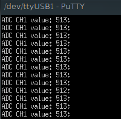
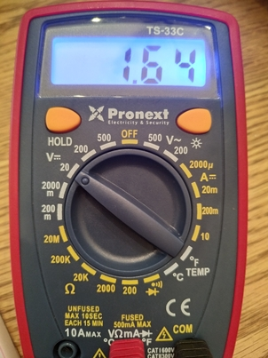

# Ejercio 5

Como se indicó en el ejercicio, se fue observando como variaban los valores que se veían por la terminal al cambiar la configuración de la conexión del resistor. El programa utilizado prácticamente es el del ejemplo **adc_dac** pero quitándole la parte del DAC. A continuación se presentan dos imágenes mostrando el valor en la terminal y la del multímetro cuando se conectó un divisor resistivo con dos resitencias iguales de $1k \Omega$ a la entrada del ADC:





Observar que en la terminal decía 513, lo cual teniendo en cuenta la resolución de 10 bits y tensión de referencia de 3,3 $V$ se obtiene una tensión 1,65 $V$.

Las funciones más importantes involucradas fueron:

```c
void adcInit(adcInit_t config )

```

Función que inicia el ADC con una frecuencia de muestreo de 200 $kHz$ y 10 bits de resolución. Dependiendo del valor del parámetro *config* se habilita o deshabilita.

```c
uint16_t adcRead(adcMap_t analogInput )
```
Función que lee lo generado por el ADC. Esta función es bloqueante. El parámetro analogInput indica por cuál canal se tiene que leer el valor

