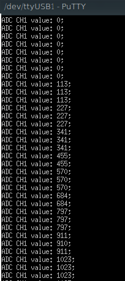

# Ejercicio 6

Este ejercicio, al igual que en el anterior, había que enviar a la terminal por USB las lecturas del ADC. La diferencia con el anterior es que en este caso el ADC estaba conectado mediante un resistor de 1 kOhm al DAC, y al DAC se lo configuraba con una tensión de 0 V a 3,3 V mediante las teclas del 0 al 9 de una computadora, donde 0 corresponde a 0 V y 9 a 3,3 V. A continuación se muestra una figura con el resultado en la terminal, tocando las teclas del 0 al 9:



Las funciones usadas en este ejercicio para el manejo del DAC son las siguientes:


```c
void dacInit(adcInit_t config )

```
Función que inicia el DAC. Dependiendo del valor del parámetro *config* se habilita o deshabilita.

```c
void dacWrite(dacMap_t analogOutput, uint16_t value)
```

Esta función escribe en la salida DAC "analogOutput" el valor "value", el cual toma valores del 0 al 1023 (por los 10 bits de resolución).
