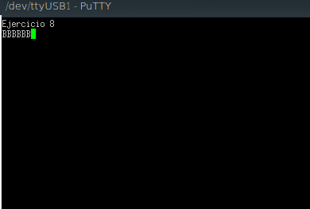

# Ejercicio 8

Este ejercicio prácticamente consistía en hacer uso del ejercicio 3, en donde al presionar una tecla de la PC se encendía un LED (haciendo uso de la UART_USB). La diferencia está en que también se usa el pin Tx de la UART_232 para transmitir un caracter que representa esta operación. Además, como se conecta un resistor entre el pin Tx y Rx de la UART_232, por el pin Rx se va a recibir el mismo caracter que se transmite por Tx y, finalmente, se transmite por el pin Tx de la UART_USB lo recibido por el pin Rx de la UART_232 para observar el resultado por pantalla. En las siguientes imágenes se muestra un esquema de esta operación para que se entienda mejor y el resultado en la terminal al presionar la tecla 'B':




Las funciones más importantes para este ejercicio fueron:


```c
void uartInit( uartMap_t uart, uint32_t baudRate )

```

Inicializa la UART "uart" con un baudrate de valor "baudRate".

```c
void uartInterrupt(uartMap_t uart, bool_t enable)

```

Habilita o deshabilita las interrupciones de la UART "uart" dependiendo del valor de "enable" (true o false). 

```c
void uartCallbackSet( uartMap_t uart, uartEvents_t event, callBackFuncPtr_t callbackFunc, void* callbackParam )

```
Setea la función a ser llamada cuando ocurre una interrupción de la UART "uart". La función a llamar es "callbackFunc" con parámetros "callbackParam" cuando hay algo para leer en el buffer o cuando la UART está lista para escribir dependiendo de los establecido por "event" (UART_RECEIVE o UART_TRANSMITER_FREE). Las funciones de callback seteadas para las UARTs en este caso fueron las siguientes: 

```c
void uartUSBreadHook(void *noUsado)
{
	static bool_t ledb_on = false;
	static bool_t led1_on = false;
	static bool_t led2_on = false;
	static bool_t led3_on = false;
	char uartReadBuff;

	uartReadByte(UART_USB, &uartReadBuff);
	switch(uartReadBuff)
	{
	  	 case 'B':
	  		 if(!ledb_on)
	  		 {
	  			 gpioWrite( LEDB, true);
	  			 ledb_on = true;
	  		 }
	  		 else
	  		 {
      			gpioWrite( LEDB, false);
      			ledb_on = false;
      		 }
       		 break;
       	 case '1':
      		 if(!led1_on)
      		 {
       			 led1_on = true;
       			 gpioWrite( LED1, true);
		     }
      		 else
      		 {
		     	 gpioWrite(LED1, false);
		     	 led1_on = false;
		     }
		     break;
		  case '2':
			 if(!led2_on)
		      {
		          gpioWrite( LED2, true);
		          led2_on = true;
		      }
		      else
		      {
		    	  gpioWrite( LED2, false);
		          led2_on = false;
		      }
		      break;
		   case '3':
			   if(!led3_on)
		       {
				   gpioWrite( LED3, true);
		            led3_on = true;
		        }
		        else
		        {
		        	gpioWrite( LED3, false);
		        	led3_on = false;
		        }
		        break;
		     default:
		     	 break;
		  }
	uartWriteByte(UART_232, uartReadBuff);
}
```
```c
void uart232readHook(void *noUsado)
{
	char dato;
	uartReadByte(UART_232, &dato);
	uartWriteByte(UART_USB, dato);
}

```